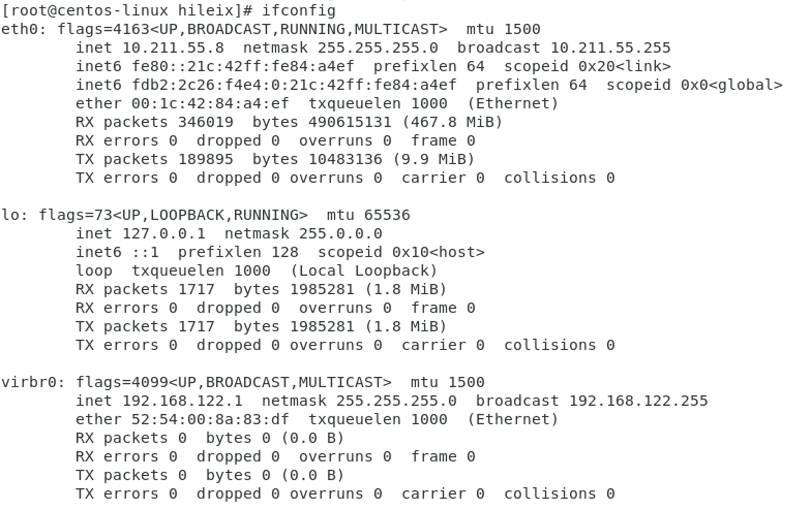

# ifconfig 命令

ifconfig 是 interface config 的缩写，用来查看和配置网络设备。

## 查看网络设备

```shell
ifconfig
```



- eth0: 表示第一块网卡，其中的 inet 就是我们一般在内网中会使用到的 ip 地址。
- lo: 表示回环接口。

## 禁用网络（网卡）

```shell
ifconfig eth0 down
```

禁用第一块网卡。

## 启动网络（网卡）

```shell
ifconfig eth0 up
```

启用第一块网卡。

## 参考

- https://blog.csdn.net/Jerry_1126/article/details/70976501
- https://www.cnblogs.com/jing99/p/7880552.html
- https://www.computerhope.com/unix/uifconfi.htm
